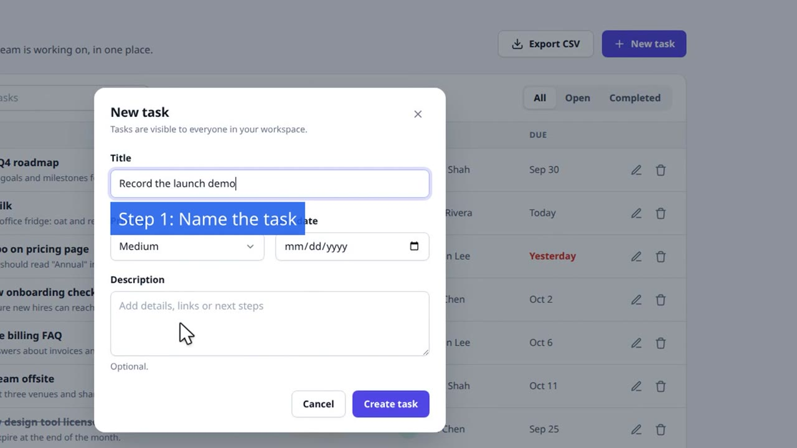

# NaraScreen

**Narrated product demo videos, recorded by you or scripted by your AI.**

Free. Local. Open source. No cloud, no accounts, no watermarks.

[](https://mukul47.github.io/NaraScreen/media/narascreen-every-effect.mp4)

▶ [Watch every effect in 60 seconds](https://mukul47.github.io/NaraScreen/media/narascreen-every-effect.mp4) · [same video without subtitles](https://mukul47.github.io/NaraScreen/media/narascreen-every-effect-nosubs.mp4). One [JSON script](docs/media/every-effect.demo-script.json) drives a real browser: the drawn pointer, the follow camera, fade and slide transitions, chapters (0:00 Intro · 0:04 Focus the eye · 0:20 Show the work · 0:42 Keep secrets safe), the highlighter, spotlight, zoom, arrow, callouts, fast-forward, skip, blur, title cards and music. The subtitle-free cut is the same job produced again with `"subtitles": false`, no re-recording.

🌐 **Multi-language and agent example:** [the original showcase](https://mukul47.github.io/NaraScreen/media/narascreen-showcase.mp4) ([script](docs/media/showcase.demo-script.json)): voices in English, Hindi and Japanese, and how an AI agent writes the script for you.

📖 **Step-by-step desktop tutorial:** [mukul47.github.io/NaraScreen/tutorial](https://mukul47.github.io/NaraScreen/tutorial/) · [project site](https://mukul47.github.io/NaraScreen/)

---

## Two ways to make a video

| | 🖱️ Desktop app | 🤖 Scripts & HTTP API |
|---|---|---|
| **You** | record your screen by hand | describe the demo in a JSON file, or let an AI agent write it |
| **Then** | place effects on a timeline, press **Produce** | `validate` → `check` → `make` |
| **Best for** | one-off videos, quick edits | repeatable demos, many languages, CI, agents |
| **Start here** | [Desktop tutorial](https://mukul47.github.io/NaraScreen/tutorial/) | [Scripts and the HTTP API](#scripts-and-the-http-api) · [LLM guide](#for-ai-agents-llm-guide) |

Both use the same renderer, effects and voices. A job made by a script is also a desktop session: open it in the app to fine-tune by hand.

---

## Quick start

**You need:** [Node.js](https://nodejs.org/) 20, [FFmpeg](https://ffmpeg.org/) on your PATH, and [Docker](https://www.docker.com/) for the voice engine.

```bash
# 1. The voice engine (Kokoro TTS), once
docker compose up -d                  # http://localhost:8880; the first run downloads ~500 MB

# 2. Install
cd editor && npm install

# 3a. The desktop app
npm run dev

# 3b. …or the command line
bin/narascreen doctor                 # checks ffmpeg, the browser and the voice engine
bin/narascreen make my-demo.demo-script.json --out ./jobs/my-demo
```

Screen recording in the desktop app works on Linux (X11), macOS and Windows. `npm run dist` builds an AppImage, a `.dmg` or a portable `.exe` with FFmpeg bundled.

---

## What it can do

| Effect | What the viewer sees | Desktop | Scripts |
|---|---|:---:|:---:|
| **Narrate** | Voiceover with word-highlighted subtitles; the frame freezes, or keeps playing | ✓ | ✓ |
| **Zoom** | Smooth zoom into a region, hold while talking, zoom out; several targets in a row | ✓ | ✓ |
| **Spotlight** | Everything but the element dims. Scripts add `padding`, a soft edge (`feather`) and an animated close-in (`converge`) | ✓ | ✓ |
| **Arrow** | A curved arrow draws itself to the element, with a label. Scripts add `color` and a pencil-loop `highlight` | ✓ | ✓ |
| **Callout** | Label, step counter ("Step 2: …") or lower-third banner | ✓ | ✓ |
| **Blur** | Hide secrets: API keys, emails, anything private | ✓ | ✓ |
| **Highlighter** | A marker stroke sweeps over text, holds, fades; or a hand-drawn underline | – | ✓ |
| **Mouse pointer** | A drawn cursor glides to each element and ripples on clicks (on by default) | – | ✓ |
| **Follow camera** | Zooms toward the action while the video keeps playing, then eases back out | – | ✓ |
| **Transitions** | Fade or slide between pages, hiding loading flashes | – | ✓ |
| **Chapters** | Real MP4 chapters, a YouTube chapter list, optional on-screen chapter badges | – | ✓ |
| **Speed · Skip · Mute** | Fast-forward typing, cut waits, silence audio | ✓ | ✓ |
| **Music** | Background track, automatically lowered under the voice | ✓ | ✓ |
| **Title & end cards** | Animated intro and outro with logo and call to action | – | ✓ |
| **Languages** | 9 languages, 54 Kokoro voices; scripts render every language in one run, in parallel | ✓ | ✓ |
| **Edit an existing video** | Add all of the above to a recording you already have | ✓ (Import) | ✓ (`source.video`) |
| **Flutter apps** | Record a Flutter web build as an Android phone | – | ✓ |

**Voices:** English (20), British English (8), Chinese (8), Japanese (5), Hindi (4: `hf_alpha`, `hf_beta`, `hm_omega`, `hm_psi`), Spanish (3), Brazilian Portuguese (3), Italian (2), French (1). List them with `bin/narascreen voices`.

---

## Scripts and the HTTP API

A **demo script** is one JSON file: what to do in the browser (**acts**) and what to show and say (**fx**), step by step. NaraScreen drives a real Chromium, records it, generates the voice, measures where every element was, and renders the effects. You never write timestamps or pixel coordinates.

```json
{
  "version": 1,
  "scope": "Create a task",
  "baseUrl": "https://app.example.com",
  "languages": ["en", "hi"],
  "steps": [
    {
      "id": "create",
      "beat": [
        { "act": "click", "role": "button", "name": "New task" },
        { "fx": "spotlight", "anchor": { "role": "dialog", "name": "New task" }, "feather": 20, "converge": 0.6 },
        { "fx": "narrate", "narrate": { "en": "Give the task a name.", "hi": "टास्क को एक नाम दें।" } },
        { "act": "fill", "label": "Title", "value": "Ship the launch video" },
        { "act": "click", "role": "button", "name": "Create task" },
        { "fx": "arrow", "anchor": { "text": "Ship the launch video" }, "text": "Your new task", "highlight": true }
      ]
    }
  ]
}
```

```bash
bin/narascreen validate demo.json   # instant: schema and rules, every problem at once
bin/narascreen check    demo.json   # seconds: runs the browser steps, no recording
bin/narascreen make     demo.json   # the video(s): job/video/final_en.mp4, final_hi.mp4
```

Run it as a server for other programs and agents:

```bash
bin/narascreen serve                # http://127.0.0.1:4790 (local only by default)
```

| Endpoint | What |
|---|---|
| `GET /llms.txt` | Short orientation for LLMs: start here |
| `GET /docs` · `GET /docs.md` | The full manual, as a page or as Markdown |
| `GET /v1/schema` | JSON Schema of the demo script |
| `POST /v1/validate` · `POST /v1/scripts` | Check or save a script |
| `POST /v1/runs` | Run a command (`inspect`, `check`, `make`, `produce`, …), then `GET /v1/runs/<id>?wait=300` or stream `/events` |
| `PUT /v1/files?path=uploads/…` · `GET /v1/files?path=…` | Upload inputs (voiceover, music, logo); download videos and previews |

The full manual is [`editor/api/MANUAL.md`](editor/api/MANUAL.md); the server also serves it at `/docs`.

---

## For AI agents (LLM guide)

This section is written for an AI agent (Claude Code, Cursor, Codex, a custom agent) that has been asked to make a demo video with NaraScreen. Humans: paste the prompt at the end into your agent.

### What you do

You only ever do two things: **write one JSON file** (the demo script) and **call NaraScreen** (HTTP or CLI). NaraScreen records, measures, narrates and renders. Never write timestamps or pixel coordinates, and never edit files inside a job folder.

### Read first

| Source | How |
|---|---|
| Orientation (short) | `GET /llms.txt` (from `narascreen serve`) |
| Full manual | `GET /docs.md`, or `bin/narascreen manual` |
| Script schema | `GET /v1/schema`, or `bin/narascreen schema` |
| Voices per language | `GET /v1/voices`, or `bin/narascreen voices` |

### The loop

| # | Step | Command | Why |
|---|---|---|---|
| 1 | Machine ready? | `doctor` | ffmpeg, Chromium and the voice engine |
| 2 | Look at the site | `inspect --url <url>` (or `--script s.json --until <step>`) | Real elements with ready-to-paste selectors, plus a screenshot |
| 3 | Write the script | a few steps at a time | Use selectors from `inspect`, never guesses |
| 4 | Validate | `validate s.json` | Instant; lists **every** problem with a `path` and a `hint` |
| 5 | Dry run | `check s.json` | Runs the browser steps without recording; failures come with `candidates` and a screenshot |
| 6 | Make | `make s.json --out <job>` | Records, narrates, renders, previews |
| 7 | Look | open `preview.contactSheet` | A JPEG grid of frames. Check it before you deliver |
| 8 | Iterate | edit the script, `make` again | Text-only edits (narration, captions, voices, durations, subtitles, cursor, camera, transitions, step chapters) reuse the recording |

### Responses

Every command returns one JSON envelope, on stdout for the CLI and as the HTTP body:

```json
{ "ok": false, "command": "check",
  "error": { "code": "SELECTOR_NOT_FOUND", "message": "…", "hint": "…",
             "where": { "step": "create", "entry": 2, "path": "steps[0].beat[2]" },
             "details": { "candidates": [ … ], "screenshot": "…" } },
  "warnings": [], "next": ["…"] }
```

Branch on `ok` and `error.code`; do what `error.hint` says; `next` lists the obvious next commands. Read `warnings` too.

### Effects cheat sheet

```json
{ "fx": "narrate", "narrate": "One sentence." }
{ "fx": "narrate", "narrate": { "en": "Hello.", "hi": "नमस्ते।" } }
{ "fx": "zoom", "anchor": { "role": "region", "name": "Weekly progress" }, "narrate": "Zoom in on the detail." }
{ "fx": "spotlight", "anchor": { "role": "button", "name": "Save" }, "padding": 12, "feather": 24, "converge": 0.6 }
{ "fx": "arrow", "anchor": { "role": "button", "name": "Export" }, "text": "Click here", "highlight": true, "color": "#F97316" }
{ "fx": "callout", "style": "lower-third", "text": "Step one: plan" }
{ "fx": "blur", "anchor": { "label": "API key" }, "duration": "step-end" }
{ "fx": "highlight", "anchor": { "text": "$49 / month" }, "style": "marker", "color": "#FDE047" }
{ "fx": "chapter", "title": "Export" }
{ "fx": "speed", "factor": 3, "until": "next-act" }
{ "fx": "skip", "until": "next-act" }
```

Top level: `baseUrl`, `viewport`, `setup` (sign-in, not recorded), `languages`, `tts.voices`, `music`, `output` (`resolution`, `quality`), `intro` / `outro` cards, and `plan` (audience, takeaway, targetSec; `validate` warns when the script drifts from it). Also:

```json
"cursor":      { "show": true, "size": 1.2, "clickEffect": true, "color": "#FFFFFF" },
"camera":      { "follow": true, "scale": 1.8, "ease": 0.8, "hold": 1.2 },
"transition":  "fade",
"chapters":    { "onScreen": true, "introTitle": "Intro" },
"subtitles":   false
```

Per step: `"chapter": "Export"` (or `{ "en": …, "hi": … }`, or `true` = the step's `label`), `"transition": { "type": "slide", "duration": 0.5 }`, `"camera": { "follow": false }`. Chapters come back in the result as `videos[].chapters: [{ title, start, end, timecode }]`, are written into the MP4, and `videos[].chapterFiles.youtube` is a ready-to-paste YouTube chapter list. Changing any of these re-renders without re-recording.

### Rules that save time

1. **Inspect, don't guess.** Guessed selectors are the #1 cause of failures.
2. **Cheap before expensive:** `validate` (instant), then `check` (seconds), then `make` (minutes).
3. **`check` and `make` really click.** They save forms and create records on the site. Reset demo data before `make` if the flow changes state.
4. **Secrets stay out of the script:** write `"value": "${env:DEMO_PASSWORD}"` and pass the value in the environment (or in `env` on `POST /v1/runs`).
5. **Over HTTP, everything lives in the server's workspace:** use job names and `uploads/…` paths from `PUT /v1/files`.
6. **Look before you deliver:** open the contact sheet and a few frames.

### Point your agent at it

Start the server (`editor/bin/narascreen serve`), then give your agent something like this:

```text
You can make narrated demo videos with NaraScreen, running locally at http://127.0.0.1:4790.
Read http://127.0.0.1:4790/llms.txt first, then /docs.md when you need details.
Goal: a ~60-second video of <what to show> on <site URL>, narrated in <languages>.
Audience: <who>. They should come away knowing: <takeaway>.
Use inspect to get selectors, save the script with POST /v1/scripts, dry-run it with the
"check" command, then "make" it. Send me the video path and the contact sheet when done.
Keep the script file so I can edit it later.
```

The script is plain JSON, so you can edit it yourself at any time and `make` again. Only changes to browser steps trigger a new recording.

---

## Everything stays on your machine

The browser (Playwright/Chromium), the voices ([Kokoro](https://github.com/remsky/Kokoro-FastAPI), in Docker) and the rendering ([FFmpeg](https://ffmpeg.org/)) all run locally. `narascreen serve` binds to `127.0.0.1` unless you choose otherwise, and can require a token (`--token`).

---

## Repository layout

```
ui-demo-pipeline/
├── docker-compose.yml        # Kokoro voice engine (port 8880)
├── ARCHITECTURE.md           # how the pieces fit, pass by pass
├── docs/                     # GitHub Pages site (mukul47.github.io/NaraScreen): landing page, tutorial, media
└── editor/
    ├── electron/             # desktop main process + the shared renderer (produce.ts, ffmpeg passes)
    ├── src/                  # desktop UI (React): timeline, player, action editors
    ├── api/                  # headless layer: CLI, HTTP server, schema, compiler, recorder
    │   └── MANUAL.md         # the full manual (served at /docs)
    └── bin/narascreen        # CLI launcher (works from any folder)
```

See [ARCHITECTURE.md](ARCHITECTURE.md) for the production pipeline in detail.

---

## Built with

- **[Electron](https://github.com/electron/electron)** and **[React](https://github.com/facebook/react)**: the desktop app
- **[FFmpeg](https://github.com/FFmpeg/FFmpeg)** and **[libass](https://github.com/libass/libass)**: every cut, zoom, overlay, subtitle and mix
- **[Kokoro FastAPI](https://github.com/remsky/Kokoro-FastAPI)**: local text-to-speech by [@remsky](https://github.com/remsky)
- **[Playwright](https://github.com/microsoft/playwright)**: the scripted browser
- **[Zod](https://github.com/colinhacks/zod)**: the demo-script schema
- **[Vite](https://github.com/vitejs/vite)**, **[Zustand](https://github.com/pmndrs/zustand)**, **[Tailwind CSS](https://github.com/tailwindlabs/tailwindcss)**, **[Lucide](https://github.com/lucide-icons/lucide)**, **[TypeScript](https://github.com/microsoft/TypeScript)**

## License

MIT. Use it for anything.
